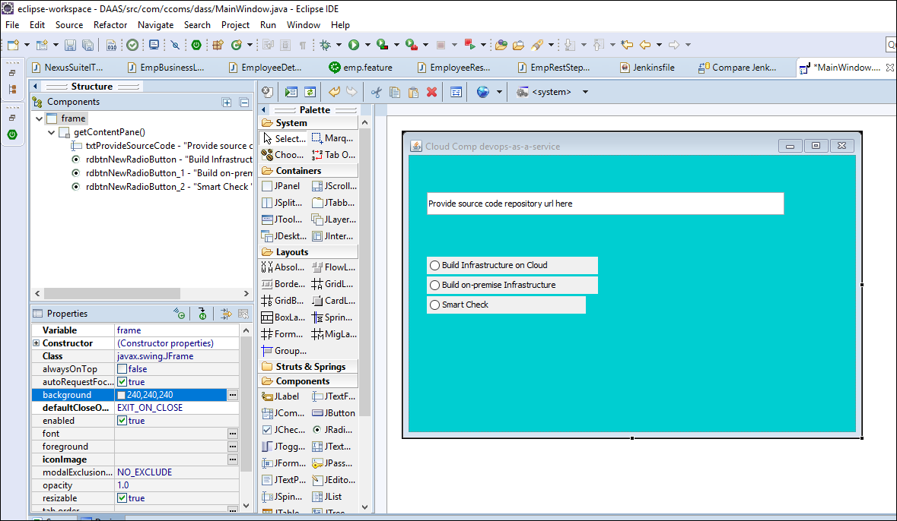
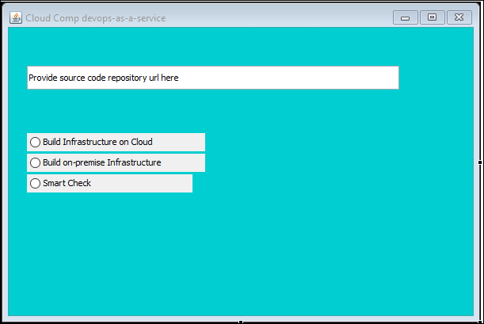

# Devops-as-a-Service
We are offering Devops solution with security to Software Organizations based on their source code. 

Table of contents
=================

<!--ts-->
   * [Abstract](#abstract)
   * [Introdution](#introduction)
   * [Software Metrics](#software-metrics)
   * [Requirement Gathering](#requirement-gathering)
   * [Implementation](#implementation)
   * [Objectives](#objectives)
<!--te-->

Abstract
========
Most of the organization still not using devops tool to make easy their software build cycle to deliver the product customer. 
There are number of reasons for this
- Organizations are using old project building tools like ant and unable to shift entire project to Maven & Gradle due framework dependencies.
- unable to migrate monolithic application to microservices.
- just now started migrating monolithic application to microservice. since application is too big, they started using restapis and slowly migrating to microservices.

Development Phase
=================

- For creating on-premise infrastructure, we uses Vagrant  
- And for creating cloud infrastructure we use terraform. 

I am using eclipse IDE with window builder plugin to create standalone application.  

* Please find below screenshots while developing window using eclipse 

* Final window 

